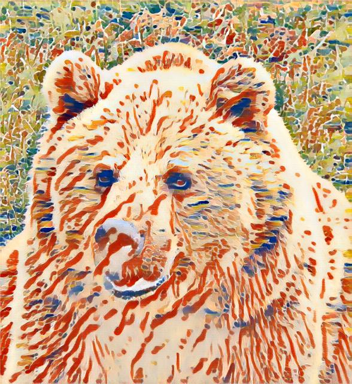

# Fast Neural Style Transfer in Pytorch :art: :rocket:

A Pytorch implementation of paper [**Perceptual Losses for Real-Time Style Transfer and Super-Resolution**](https://arxiv.org/abs/1603.08155) by *Justin Johnson, Alexandre Alahi, and Fei-Fei Li*. ***Note that*** the original paper proposes the algorithm to conduct 1) neural style transfer task and 2) image super-resolution task. This implementation can only be used to stylize images with arbitrary artistic style.

The idea 'neural style transfer' is proposed by *Leon A. Gatys, Alexander S. Ecker, Matthias Bethge* in paper [**Image Style Transfer Using Convolutional Neural Networks**](https://www.cv-foundation.org/openaccess/content_cvpr_2016/papers/Gatys_Image_Style_Transfer_CVPR_2016_paper.pdf), where the content features are represented as outputs of some selected VGG-16 layers and style features are represented as their Gram matrix.

This repo is based on the code [**fast-neural-style-pytorch**](https://github.com/rrmina/fast-neural-style-pytorch) by *rrmina* and [**fast_neural_style**](https://github.com/pytorch/examples/tree/main/fast_neural_style) by *Pytorch Official*.

## Dependencies
Tested With:
* Windows 10/11 || Mac M1 chip || Ubuntu 22.04 (Reconmended)
* Python 3.7
* Pytorch 1.10

```
conda create -n fst python=3.7
conda activate fst
pip install -r requirements.txt
```

## Example Output
```
python stylize_arg.py --content-image ./pretrained_models/bear.jpg --model ./pretrained_models/Fauvism_André-Derain_Pier.pth
```

<p align="center">
    
    
    
</p>

## Usage
***Train the model*** :hammer_and_wrench:

```
python train_arg.py --dataset <path/to/content/images/folder> --style-image <path/to/style/image/file>
```

- `--dataset`: path to training content images folder, I use Train images [118K/18GB] in [COCO 2017](https://cocodataset.org/#download).
- `--style-image`: path to style-image.
- `--save-model-dir`: path to folder where trained model will be saved.
- `--model-name`: name of saved model.
- `--content-weight`: weight for content-loss, default is 1e5.
- `--style-weightt`: weight for style-loss, default is 1e10.
- `--consistency-weight`: weight for consistency-loss, default is 1e1.
- `--mps`: add it for running on macOS GPU
- `--model-type`: architecture for stylization network. including: 1. ae: Autoencoder; 2. bo: bottleneck; 3. res: resNext.

Refer to `train_arg.py` for other command line arguments. Refer to `models` folder for details of neural network architecture.
For training new models you might have to tune the values of `--content-weight`, `--style-weight` and `--consistency-weight`. 

***Stylize the image*** :paintbrush:

```
python stylize_arg.py --content-image <path/to/content/image/file> --model <path/to/saved/model>
```

- `--content-image`: path to content image you want to stylize.
- `--model`: saved model to be used for stylizing the image (eg: `mosaic.pth`)
- `--output-path`: path for saving the output image.
- `--output-name`: name of output image.
- `--content-scale`: factor for scaling down the content image if memory is an issue (eg: value of 2 will halve the height and width of content-image)
- `--mps`: add it for running on macOS GPU
- `--model-type`: architecture for stylization network. including: 1. ae: Autoencoder; 2. bo: bottleneck; 3. res: resNext.

Make sure that stylizaiton neural network has same `model-type` with pre-trained model.
